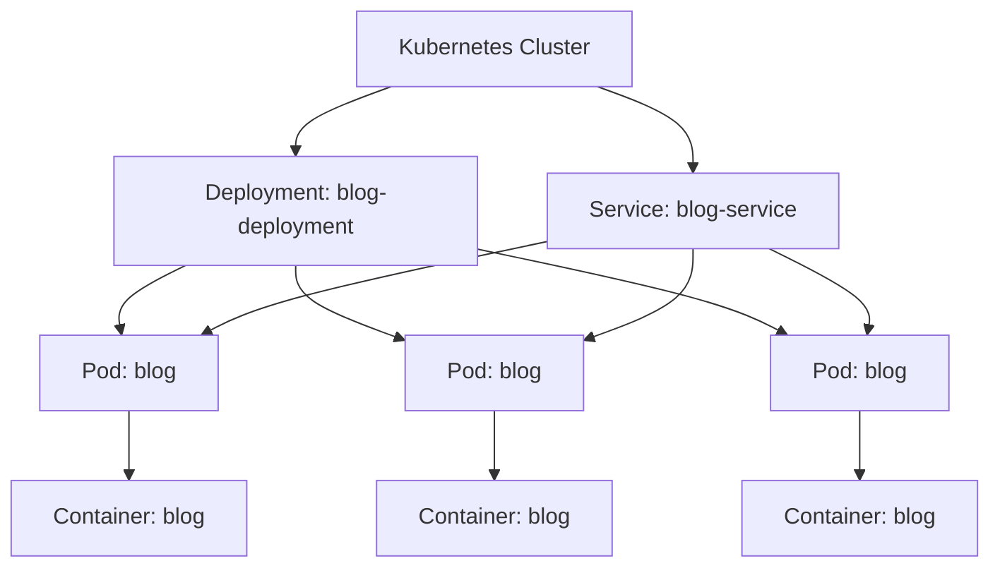

# Kubernetes Architektur

Dieses Diagramm zeigt die Architektur der Kubernetes-Ressourcen, die in diesem Projekt verwendet werden, einschließlich Deployment und Service.

## Beschreibung

- **Kubernetes Cluster**: Der Cluster, in dem alle Ressourcen laufen.
- **Deployment: blog-deployment**: Ein Deployment, das sicherstellt, dass immer eine bestimmte Anzahl von Pods läuft.
- **Pod: blog**: Ein Pod, der die Anwendung enthält. In diesem Fall gibt es drei Replikate des Pods.
- **Container: blog**: Der Container innerhalb des Pods, der die Anwendung ausführt.
- **Service: blog-service**: Ein Service, der den Zugriff auf die Pods ermöglicht und den Netzwerkverkehr verteilt.

## Dateien

- **Deployment**: [deployment.yaml](deployment.yaml)
- **Service**: [service.yaml](service.yaml)
